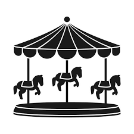

<!DOCTYPE html>
<html lang="fr">
<head>
    <meta charset="UTF-8">
    <meta name="viewport" content="width=device-width, initial-scale=1.0">
    <title>Stabilité & Systèmes | Démanteler le cirque du coaching</title>
    <link href="https://fonts.googleapis.com/css2?family=Inter:wght@300;400;700&family=Space+Grotesk:wght@500;700&display=swap" rel="stylesheet">
    
    
</head>
<body>

    <section class="hero">
        

            

                <h1>On arrête le cirque, on stabilise ton revenu !</h1>
                
Tu es coach, tu as déjà des clientes, mais ton revenu fait le yo‑yo et tu es épuisée par les “stratégies miracles” et les to‑do listes infinies.

                
Ici, on enlève le superflu, on garde ce qui marche, et tu repars avec un plan simple que tu peux tenir.

                <a href="#" class="btn-premium">Démarrer le démantèlement</a>
            

            

                <!-- Image brute sans conteneur circulaire -->
                
            

        

    </section>

</body>
</html>
